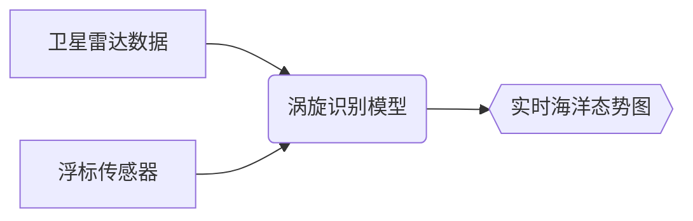

# 🌊⛅️🛰️ 智能海洋大气实验室 (OceanAI Lab)

  
*▲ 实验室主楼与相控阵雷达观测台*

## 🏛️ 实验室概况
**OceanAI Lab** 成立于2018年，拥有国际领先的`海洋雷达-AI融合研究平台`。核心设施包括：

  
   

  
*◀ 左：X/C/S三波段雷达阵列 | 右：配备200张A100的海洋超算中心*

## 🔍 核心研究方向
### 1. 大语言雷达模型 (LLRM)
  
*▲ 我们提出的雷达-语言多模态对齐框架（Nature Climate Change 2024）*

### 2. 海洋大气智能感知

  
*▶ 模型对2023年台风"海燕"的提前72小时预测*

## 🌟 标志性成果
| 成果 | 可视化 | 应用 |
|------|--------|------|
| **LLRM-1模型** |  | 中央气象台部署 |
| **浪高预测系统** |  | 南海航运预警 |

## 🎓 团队风采

  
  
    

  
*实验室成员的日常科研工作场景*

## 📍 联系我们
  
**地址**：XX省海洋科技园32号（[查看3D导览](static/3d_tour.html)）
